# Use Azure Machine Learning Designer

## Overview

Azure Machine Learning *designer* provides a drag & drop environment in which you can define a workflow, or *pipeline* of data ingestion, transformation, and model training modules to create a machine learning model. You can then publish this pipeline as a web service that client applications can use for *inferencing* (generating predictions from new data).

## Create a dataset

Now that you have some compute resources that you can use to process data, you'll need a way to store and ingest the data to be processed.

1. On the LabVM browser open new tab and browse https://aka.ms/diabetes-data. Then save this as a local file named **diabetes.csv** (it doesn't matter where you save it).

2. In Azure Machine Learning studio, view the **Datasets** page on the left panel. Datasets represent specific data files or tables that you plan to work with in Azure ML.

3. Create a new dataset from local files, using the following settings:

    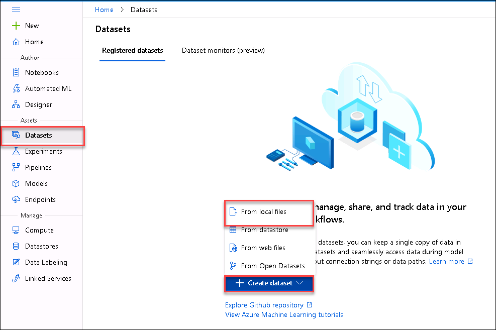
    
    * **Basic Info**:
        * **Name**: diabetes dataset
        * **Dataset type**: Tabular
        * **Description**: Diabetes data
        
    
    
    * **Datastore and file selection**:
        * **Select or create a datastore**: Currently selected datastore
        * **Select files for your dataset**: click **upload** and Browse to the **diabetes.csv** file you downloaded.
        * **Upload path**: *Leave the default selection*
        * **Skip data validation**: Not selected
        
     
    
     
    
    
    * **Settings and preview**:
        * **File format**: Delimited
        * **Delimiter**: Comma
        * **Encoding**: UTF-8
        * **Column headers**: only first file has headers
        * **Skip rows**: None
        
    
    
    * **Schema**:
        * Include all columns other than **Path**
        * Review the automatically detected types
    * **Confirm details**:
        * Do not profile the dataset after creation
        
    

## Create a designer pipeline

To get started with designer, first you must create a pipeline and add the dataset you want to work with.

1. In Azure Machine Learning studio, view the **Designer** page and create a new pipeline.

    

2. In the **Settings** pane, change the default pipeline name (**Pipeline-Created-on-*date***) to **Visual Diabetes Training** (if the **Settings** pane is not visible, click the **&#9881;** icon next to the pipeline name at the top).

    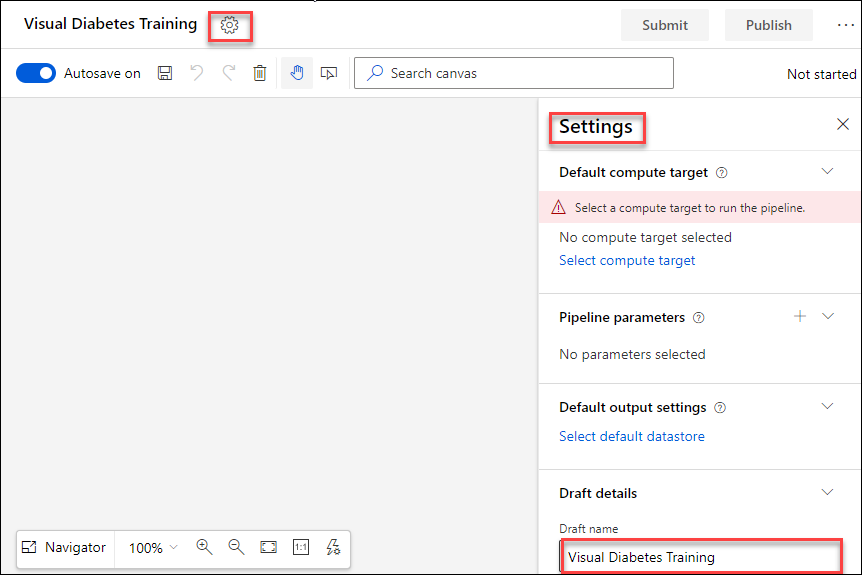

3. Note that you need to specify a compute target on which to run the pipeline. In the **Settings** pane, click **Select compute target** and select your compute cluster.

    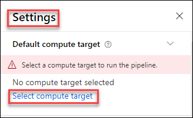
    
    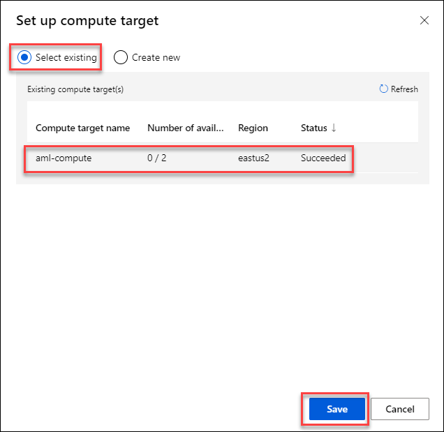

4. On the left side of the designer, expand the **Datasets** section, and drag the **diabetes dataset** dataset onto the canvas.

    

5. Select the **diabetes dataset** module on the canvas. Then right-click it, and on the **Visualize** menu, select **Dataset output**.

6. Review the schema of the data, noting that you can see the distributions of the various columns as histograms. Then close the visualization.

## Add transformations

Before you can train a model, you typically need to apply some preprocessing transformations to the data.

1. In the pane on the left, expand the **Data Transformation** section, which contains a wide range of modules you can use to transform data before model training.

2. Drag a **Normalize Data** module to the canvas, below the **diabetes dataset** module. Then connect the output from the **diabetes dataset** module to the input of the **Normalize Data** module.

    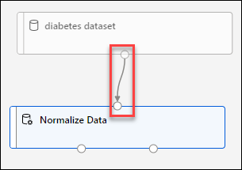

3. Select the **Normalize Data** module and view its settings, noting that it requires you to specify the transformation method and the columns to be transformed. Then, leaving the transformation as **ZScore**, edit the columns to includes the following column names:
    * PlasmaGlucose
    * DiastolicBloodPressure
    * TricepsThickness
    * SerumInsulin
    * BMI
    * DiabetesPedigree

    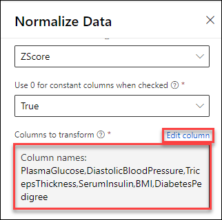
    
        

    **Note**: We're normalizing the numeric columns put them on the same scale, and avoid columns with large values dominating model training. You'd normally apply a whole bunch of pre-processing transformations like this to prepare your data for training, but we'll keep things simple in this exercise.

4. Now we're ready to split the data into separate datasets for training and validation. In the pane on the left, in the **Data Transformations** section, drag a **Split Data** module onto the canvas under the **Normalize Data** module. Then connect the *Transformed Dataset* (left) output of the **Normalize Data** module to the input of the **Split Data** module.

5. Select the **Split Data** module, and configure its settings as follows:
    * **Splitting mode** Split Rows
    * **Fraction of rows in the first output dataset**: 0.7
    * **Random seed**: 123
    * **Stratified split**: False

    

## Add model training modules

With the data prepared and split into training and validation datasets, you're ready to configure the pipeline to train and evaluate a model.

1. Expand the **Model Training** section in the pane on the left, and drag a **Train Model** module to the canvas, under the **Split Data** module. Then connect the *Result dataset1* (left) output of the **Split Data** module to the *Dataset* (right) input of the **Train Model** module.

2. The model we're training will predict the **Diabetic** value, so select the **Train Model** module and modify its settings to set the **Label column** to  **Diabetic** (matching the case and spelling exactly!)

    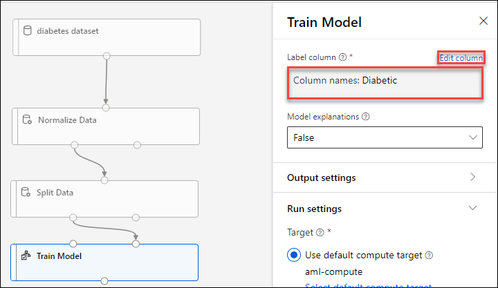

3. The **Diabetic** label the model will predict is a binary column (1 for patients who have diabetes, 0 for patients who don't), so we need to train the model using a *classification* algorithm. Expand the **Machine Learning Algorithms** section, and under **Classification**, drag a **Two-Class Logistic Regression** module to the canvas, to the left of the **Split Data** module and above the **Train Model** module. Then connect its output to the **Untrained model** (left) input of the **Train Model** module.

    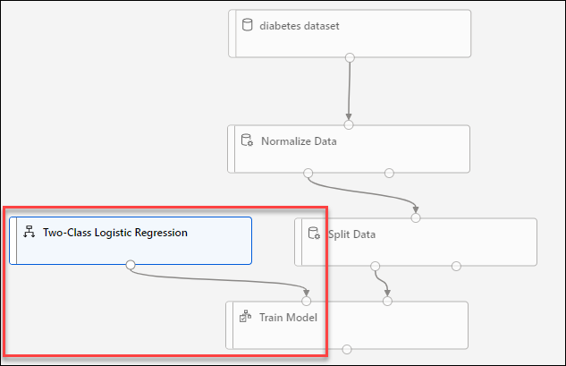

4. To test the trained model, we need to use it to score the validation dataset we held back when we split the original data. Expand the **Model Scoring & Evaluation** section and drag a **Score Model** module to the canvas, below the **Train Model** module. Then connect the output of the **Train Model** module to the **Trained model** (left) input of the **Score Model** module; and drag the **Results dataset2** (right) output of the **Split Data** module to the **Dataset** (right) input of the **Score Model** module.

5. To evaluate how well the model performs, we need to look at some metrics generated by scoring the validation dataset. From the **Model Scoring & Evaluation** section, drag an **Evaluate Model** module to the canvas, under the **Score Model** module, and connect the output of the **Score Model** module to the **Score dataset** (left) input of the **Evaluate Model** module.

    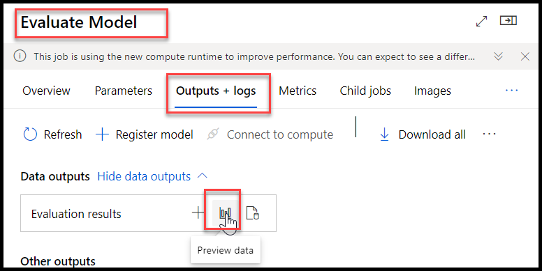

## Run the training pipeline

With the data flow steps defined, you're now ready to run the training pipeline and train the model.

1. Verify that your pipeline looks similar to the following:

    

2. At the top right, click **Submit**. Then when prompted, create a new experiment named **mslearn-designer-train-diabetes**, and run it.  This will initialize the compute cluster and then run the pipeline, which may take 10 minutes or longer. You  can see the status of the pipeline run above the top right of the design canvas.

    

    **Tip**: While it's running, you can view the pipeline and experiment that have been created in the **Pipelines** and **Experiments** pages. Switch back to the **Visual Diabetes Training** pipeline on the **Designer** page when you're done.

3. After the **Normalize Data** module has completed, select it, and in the **Settings** pane, on the **Outputs + logs** tab, under **Data outputs** in the **Transformed dataset** section, click the **Visualize** icon, and note that you can view statistics and distribution visualizations for the transformed columns.

    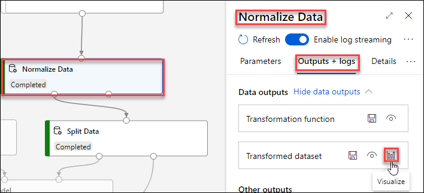

4. Close the **Normalize Data** visualizations and wait for the rest of the modules to complete. Then visualize the output of the **Evaluate Model** module to see the performance metrics for the model.

    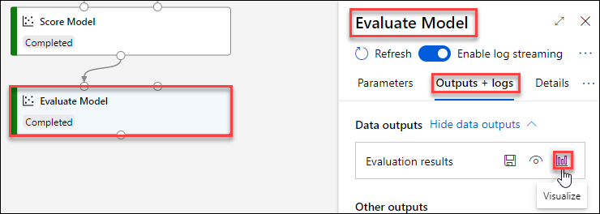

    **Note**: The performance of this model isn't all that great, partly because we performed only minimal feature engineering and pre-processing. You could try some different classification algorithms and compare the results (you can connect the outputs of the **Split Data** module to multiple **Train Model** and **Score Model** modules, and you can connect a second scored model to the **Evaluate Model** module to see a side-by-side comparison). The point of the exercise is simply to introduce you to the designer interface, not to train a perfect model!

## Create an inference pipeline

Now that you have used a *training pipeline* to train a model, you can create an *inference pipeline* that uses the trained model to predict labels for new data.

1. In the **Create inference pipeline** drop-down list, click **Real-time inference pipeline**. After a few seconds, a new version of your pipeline named **Visual Diabetes Training-real time inference** will be opened.

    

2. Rename the new pipeline to **Predict Diabetes**, and then review the new pipeline. Note that the normalization transformation and the trained model have been encapsulated in this pipeline so that the statistics from your training data will be used to normalize any new data values, and the trained model will be used to score the new data.

    

3. Note that the inference pipeline assumes that new data will match the schema of the original training data, so the **diabetes dataset** dataset from the training pipeline is included. However, this input data includes the **Diabetic** label that the model predicts, which is unintuitive to include in new patient data for which a diabetes prediction has not yet been made.

4. Delete the **diabetes dataset** dataset from the inference pipeline and replace it with an **Enter Data Manually** module from the **Data Input and Output** section; connecting it to the same **dataset** input of the **Apply Transformation** module as the **Web Service Input**. 

    

5. Then modify the settings of the **Enter Data Manually** module to use the following CSV input, which includes feature values without labels for three new patient observations:

```CSV
PatientID,Pregnancies,PlasmaGlucose,DiastolicBloodPressure,TricepsThickness,SerumInsulin,BMI,DiabetesPedigree,Age
1882185,9,104,51,7,24,27.36983156,1.350472047,43
1662484,6,73,61,35,24,18.74367404,1.074147566,75
1228510,4,115,50,29,243,34.69215364,0.741159926,59
```

   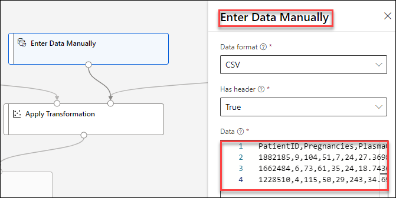

6. The inference pipeline includes the **Evaluate Model** module, which is not useful when predicting from new data, so delete this module.

7. The output from the **Score Model** module includes all of the input features as well as the predicted label and probability score. To limit the output to only the prediction and probability, delete the connection between the **Score Model** module and the **Web Service Output**, add an **Execute Python Script** module from the **Python Language** section, connect the output from the **Score Model** module to the **Dataset1** (left-most) input of the **Execute Python Script**, and connect the output of the **Execute Python Script** module to the **Web Service Output**. 

    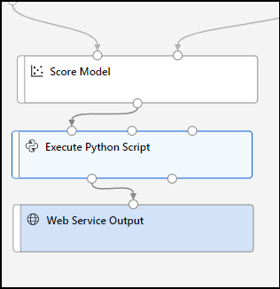

8. Then modify the settings of the **Execute Python Script** module to use the following code (replacing all existing code):

```Python
import pandas as pd

def azureml_main(dataframe1 = None, dataframe2 = None):

    scored_results = dataframe1[['PatientID', 'Scored Labels', 'Scored Probabilities']]
    scored_results.rename(columns={'Scored Labels':'DiabetesPrediction',
                                    'Scored Probabilities':'Probability'},
                            inplace=True)
    return scored_results
```

   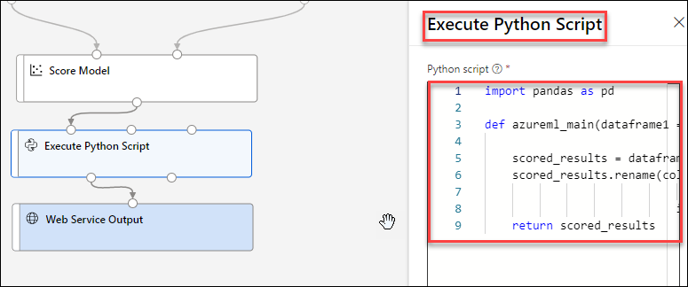

9. Verify that your pipeline looks similar to the following:

    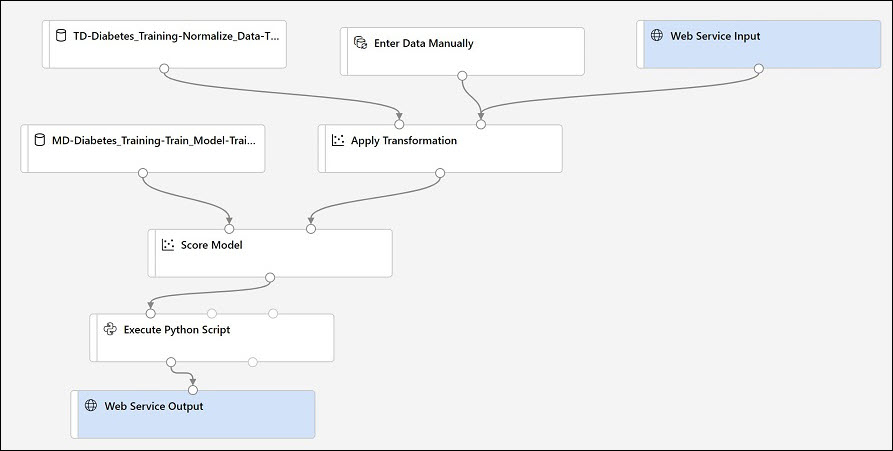

10. Submit the pipeline as a new experiment named **mslearn-designer-predict-diabetes** on the compute cluster you used for training. This may take a while!

    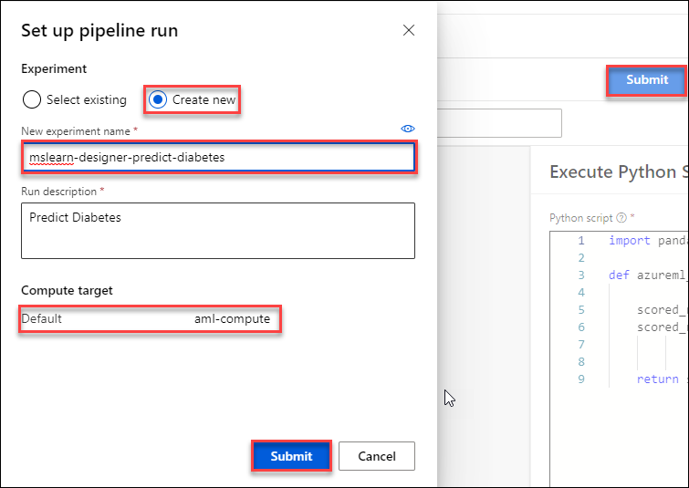

## Deploy the inference pipeline as a web service

Now you have an inference pipeline for real-time inferencing, which you can deploy as a web service for client applications to use.

> **Note**: In this exercise, you'll deploy the web service to to an Azure Container Instance (ACI). This type of compute is created dynamically, and is useful for development and testing. For production, you should create an *inference cluster*, which provide an Azure Kubernetes Service (AKS) cluster that provides better scalability and security.

1. If the **Predict Diabetes** inference pipeline has not yet finished running, await it's completion. Then visualize the **Result dataset** output of the **Execute Python Script** module to see the predicted labels and probabilities for the three patient observations in the input data.

2. At the top right, click **Deploy**, and deploy a new real-time endpoint, using the following settings:
    -  **Name**: designer-predict-diabetes
    -  **Description**: Predict diabetes.
    - **Compute type**: Azure Container Instance

    
    
    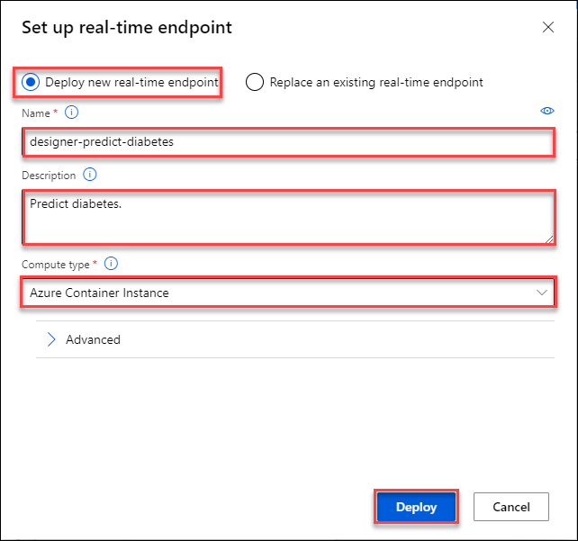    

3. Wait for the web service to be deployed - this can take several minutes. The deployment status is shown at the top left of the designer interface.

## Test the web service

Now you can test your deployed service from a client application - in this case, you'll use a notebook.

1. On the **Endpoints** page, open the **designer-predict-diabetes** real-time endpoint.

    

2. When the **designer-predict-diabetes** endpoint opens, on the **Consume** tab, note the **REST endpoint** and **Primary key** values.

    

3. With the **Consume** page for the **designer-predict-diabetes** service page open in your browser, open a new browser tab and open a second instance of Azure Machine Learning studio. Then in the new tab, view the **Notebooks** page.

4. In the **Notebooks** page, under **My files**, browse to the **Users/mslearn-dp100** folder where you cloned the notebook repository, and open the **Get Designer Prediction** notebook.

    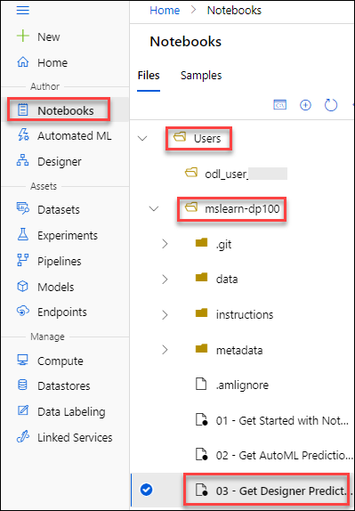

5. When the notebook has opened, ensure that the compute instance **Notebook-{DeploymentID}** is selected in the **Compute** box, and that it has a status of **Running**.

6. In the notebook, replace the **ENDPOINT** and **PRIMARY_KEY** placeholders with the values for your service, which you can copy from the **Consume** tab on the page for your endpoint.

    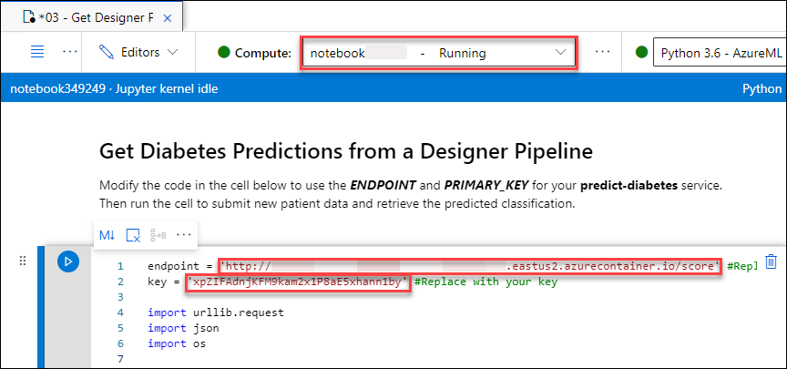

7. Run the code cell and view the output returned by your web service.

    
