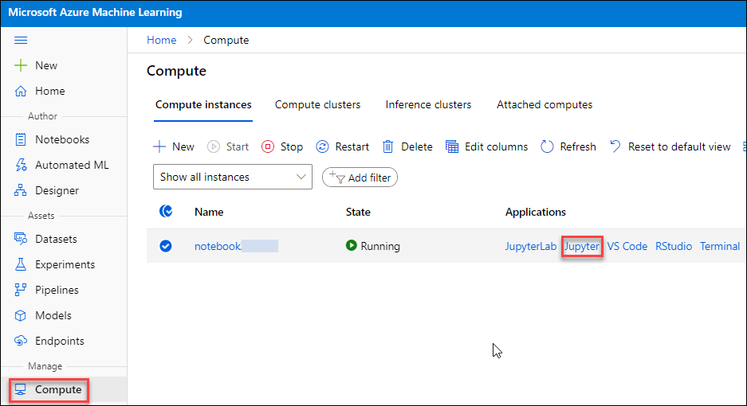
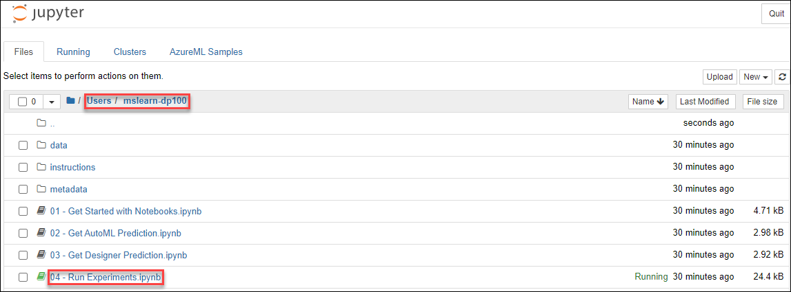

# Run Experiments

## Overview

Experiments are at the core of a data scientist's work. In Azure Machine Learning, an *experiment* is used to run a script or a pipeline, and usually generates outputs and records metrics. In this exercise, you will use the Azure Machine Learning SDK to run Python code as an experiment.

## Open Jupyter

While you can use the **Notebooks** page in Azure Machine Learning studio to run notebooks, it's often more productive to use a more fully-featured notebook development environment like *Jupyter*.

> **Tip**: Jupyter Notebook is a commonly used open-source tool for data science. You can refer to the [documentation](https://jupyter-notebook.readthedocs.io/en/stable/notebook.html) if you are unfamiliar with it.

1. In the LabVM browser open Azure Machine Learning Studio(https://ml.azure.com). If prompted, log in using the credentials provided in the **Environment Details** tab. View the **Compute** page for your workspace.

    **Note**: If you get **Welcome to the studio** page when you login, Select **Subscription** and **Machine Learning workspace** available in the drop down then click on **Get Started**.

2. On the **Compute Instances** tab, start your compute instance if it is not already running.

3. When the compute instance is running, click the **Jupyter** link to open the Jupyter home page in a new browser tab. Be sure to open *Jupyter* and not *JupyterLab*.

    

## Verify the Azure Machine Learning SDK is Installed

The Azure Machine Learning SDK is installed by default on your compute instance. Follow these steps to verify the installation.

1. In the Jupyter notebook environment, create a new **Terminal**. This will open a new tab with a command shell.

    
        

3. Enter the following command to verify that the Azure ML SDK is installed:

    ```bash
    pip show azureml-sdk
    ```

     
    
   - Note the version of the SDK package installed.

3. The **azureml-sdk** SDK package provides the most important libraries needed to work with Azure Machine Learning. However, some additional packages contain other useful libraries not included in the main SDK package. Use the following command to verify that the **azureml-widgets** package, which contains libraries for displaying Azure Machine Learning information in notebooks, is also installed:

    ```bash
    pip show azureml-widgets
    ```

    

4. Close the **Terminal** tab and return to the tab containing the Jupyter home page.

> **More Information**: For more details about installing the Azure ML SDK and its optional components, see the [Azure ML SDK Documentation](https://docs.microsoft.com/python/api/overview/azure/ml/install?view=azure-ml-py).

## Run experiments in a notebook

Experiments in Azure Machine Learning need to be initiated from some sort of *control* layer; often a script or program. In this exercise, you'll use a notebook to control experiments.

1. In the Jupyter home page, browse to the **Users/mslearn-dp100** folder where you cloned the notebook repository.

2. Click on **Run Experiments** (04 - Run Experiments.ipynb) notebook to open the new tab.

    

3. Then read the notes in the notebook, running each code cell in turn. To run each cell select and click on **Run** on the menu

4. When you have finished running the code in the notebook, on the **File** menu, click **Close and Halt** to close it and shut down its Python kernel. Then close all Jupyter browser tabs.
