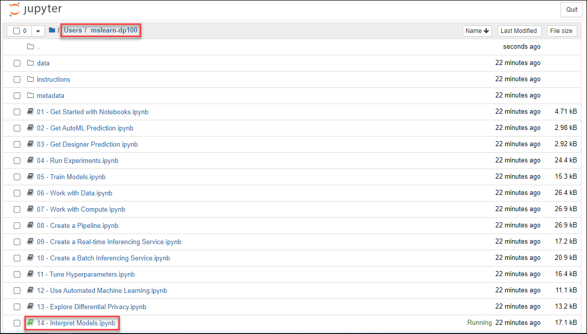

# Explore Differential Privacy

Often, the data used to train machine learning models contains sensitive values that should be kept private. Differential privacy is a technique in which "noise" is added to the data such that statistical measurements and aggregations remain consistent with the raw source data, but it is more difficult to identify values for individual observations.

## Open Jupyter

While you can use the **Notebooks** page in Azure Machine Learning studio to run notebooks, it's often more productive to use a more fully-featured notebook development environment like *Jupyter*.

> **Tip**: Jupyter Notebook is a commonly used open source tool for data science. You can refer to the [documentation](https://jupyter-notebook.readthedocs.io/en/stable/notebook.html) if you are unfamiliar with it.

1. In the LabVM browser open [Azure Machine Learning studio](https://ml.azure.com), view the **Compute** page for your workspace; and on the **Compute Instances** tab, start your compute instance if it is not already running.

    **Note**: If you get **Welcome to the studio** page when you login, Select **Subscription** and **Machine Learning workspace** available in the drop down then click on **Get Started**.

2. When the compute instance is running, click the **Jupyter** link to open the Jupyter home page in a new browser tab. Be sure to open *Jupyter* and not *JupyterLab*.

    

## Use SmartNoise to explore differential privacy

In this exercise, code to explore differential privacy with SmartNoise is provided in a notebook.

1. In the Jupyter home page, browse to the **Users/mslearn-dp100** or **Users/*{Username}*/mslearn-dp100** folder where you cloned the notebook repository, and open the **Explore Differential Privacy** (14 - Interpret Models.ipynb) notebook.

    

2. Then read the notes in the notebook, running each code cell in turn. To run each cell select and click on **Run** on the menu
3. When you have finished running the code in the notebook, on the **File** menu, click **Close and Halt** to close it and shut down its Python kernel. Then close all Jupyter browser tabs.
