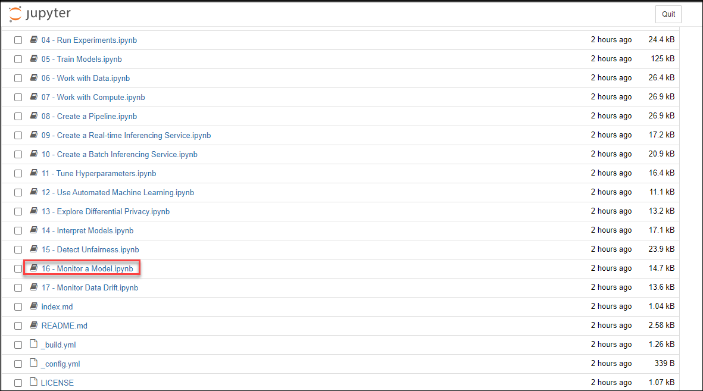

# Monitor a Model

When you deploy a model as a service, it's useful to be able to track information about the requests it processes.

Azure Machine Learning integrates with Azure Application Insights to enable you to log data from deployed services.
## Open Jupyter

While you can use the **Notebooks** page in Azure Machine Learning studio to run notebooks, it's often more productive to use a more fully-featured notebook development environment like *Jupyter*.

> **Tip**: Jupyter Notebook is a commonly used open source tool for data science. You can refer to the [documentation](https://jupyter-notebook.readthedocs.io/en/stable/notebook.html) if you are unfamiliar with it.

1. In the LabVM browser open Azure Machine Learning studio(https://ml.azure.com), view the **Compute** page for your workspace; and on the **Compute Instances** tab, start your compute instance if it is not already running.

    **Note**: If you get **Welcome to the studio** page when you login, Select **Subscription** and **Machine Learning workspace** available in the drop down then click on **Get Started**.

2. When the compute instance is running, click the **Jupyter** link to open the Jupyter home page in a new browser tab. Be sure to open *Jupyter* and not *JupyterLab*.

    

## Use Application Insights to monitor a real-time service

In this exercise, the code to configure application insights for a deployed predictive service is provided in a notebook.

1. In the Jupyter home page, browse to the **Users/mslearn-dp100** or **Users/*{Username}*/mslearn-dp100** folder where you cloned the notebook repository, and open the **Monitor a Model** (16 - Monitor a Model.ipynb) notebook.

    

2. Then read the notes in the notebook, running each code cell in turn.
3. When you have finished running the code in the notebook, on the **File** menu, click **Close and Halt** to close it and shut down its Python kernel. Then close all Jupyter browser tabs.

